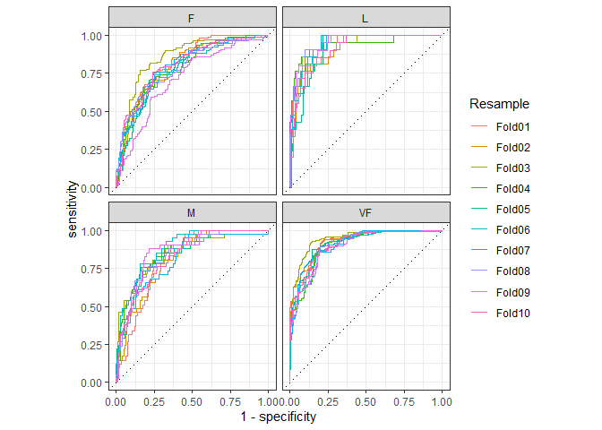

Yardstick
================
Niccolò Salvini
27/4/2020

[](https://CRAN.R-project.org/package=yardstick)
[](https://www.tidyverse.org/lifecycle/#maturing)


# A Gentle introduction

Metric types: There are three main metric types in `yardstick`: *class*,
*class probability*, and *numeric.* Each type of metric has standardized
argument syntax, and all metrics return the same kind of output (a
tibble with 3 columns). This standardization allows metrics to easily be
grouped together and used with grouped data frames for computing on
multiple resamples at once. Below are the three types of metrics, along
with the types of the inputs they take.

1.  *Class* metrics (hard predictions)
    1.  `truth` - factor
    2.  `estimate` - factor
2.  *Class probability* metrics (soft predictions)
    1.  `truth` - factor
    2.  `estimate` / … - multiple numeric columns containing class
        probabilities
3.  *Numeric* metrics
    1.  `truth` - numeric
    2.  `estimate` - numeric

## Example

Suppose you create a classification model and predict on a new data set.
You might have data that looks like this:

``` r
# two_class_example this is real data for a bin classification 
head(two_class_example)
#>    truth      Class1       Class2 predicted
#> 1 Class2 0.003589243 0.9964107574    Class2
#> 2 Class1 0.678621054 0.3213789460    Class1
#> 3 Class2 0.110893522 0.8891064779    Class2
#> 4 Class1 0.735161703 0.2648382969    Class1
#> 5 Class2 0.016239960 0.9837600397    Class2
#> 6 Class1 0.999275071 0.0007249286    Class1
```

## for two class metrics

You can use a `dplyr`-like syntax to compute common performance
characteristics of the model and get them back in a data frame:

``` r
metrics(two_class_example, truth, predicted)
#> # A tibble: 2 x 3
#>   .metric  .estimator .estimate
#>   <chr>    <chr>          <dbl>
#> 1 accuracy binary         0.838
#> 2 kap      binary         0.675
```

Or with different means, you calculating the `roc_auc()`

``` r
two_class_example %>%
  roc_auc(truth, Class1)
#> # A tibble: 1 x 3
#>   .metric .estimator .estimate
#>   <chr>   <chr>          <dbl>
#> 1 roc_auc binary         0.939
```

## a further example

### buuut first recall whats precision

> The precision is the percentage of predicted truly relevant results of
> the total number of \>predicted relevant results and characterizes the
> “purity in retrieval performance” – <cite>Buckland and Gey,
> 1994</cite>

about the `precision()` metrics: calculate of a measurement system for
finding relevant documents compared to reference results (the truth
regarding relevance). Highly related functions are recall() and
f\_meas().

`precision(data, truth, estimate, estimator = NULL, na_rm = TRUE, ...)`

where:

  - **data**: Either a data.frame containing the truth and estimate
    columns
  - **truth**: The column identifier for the true class results (that is
    a `factor`), his should be an *unquoted* column name
  - **estimate** :The column identifier for the predicted class results
    (that is also factor),to use an *unquoted* variable name.
  - **estimator**: One of: " *binary*“,” *macro*“,” *macro\_weighted*“,
    or” *micro*" , to specify th type of averaging to be done. This has
    its own employment in multiclass. The default will automatically
    choose " *binary*" or " *macro*"

Value: A `tibble` with columns `.metric`, `.estimator`, and `.estimate`
and 1 row of values. example:

``` r
precision(two_class_example, truth, predicted)
#> # A tibble: 1 x 3
#>   .metric   .estimator .estimate
#>   <chr>     <chr>          <dbl>
#> 1 precision binary         0.819
```

## common general agreements in `Yardstick`

  - In `yardstick`, the default is to use the **first** level. To change
    this, a global option called `yardstick.event_first` is set to TRUE
    when the package is loaded.

-----

## Multiclass metrics

hpc\_cv is a dataframe contains the predicted classes and class
probabilities for Linear Discriminant Analysis model fit to the HPC data
set from Kuhn and Johnson (2013). These data are the assessment sets
from a 10-fold Cross-Validation scheme. The data column columns for the
true class (obs), the class prediction (pred) and columns for each class
probability (columns VF, F, M, and L). Additionally, a column for the
resample indicator is included.

``` r
data("hpc_cv")
hpc_cv = as_tibble(hpc_cv)
hpc_cv
#> # A tibble: 3,467 x 7
#>    obs   pred     VF      F       M          L Resample
#>    <fct> <fct> <dbl>  <dbl>   <dbl>      <dbl> <chr>   
#>  1 VF    VF    0.914 0.0779 0.00848 0.0000199  Fold01  
#>  2 VF    VF    0.938 0.0571 0.00482 0.0000101  Fold01  
#>  3 VF    VF    0.947 0.0495 0.00316 0.00000500 Fold01  
#>  4 VF    VF    0.929 0.0653 0.00579 0.0000156  Fold01  
#>  5 VF    VF    0.942 0.0543 0.00381 0.00000729 Fold01  
#>  6 VF    VF    0.951 0.0462 0.00272 0.00000384 Fold01  
#>  7 VF    VF    0.914 0.0782 0.00767 0.0000354  Fold01  
#>  8 VF    VF    0.918 0.0744 0.00726 0.0000157  Fold01  
#>  9 VF    VF    0.843 0.128  0.0296  0.000192   Fold01  
#> 10 VF    VF    0.920 0.0728 0.00703 0.0000147  Fold01  
#> # ... with 3,457 more rows
```

Here you are computing the precision for multiclass with the default
string for **estimator**: *macro*

``` r
# Macro averaged multiclass precision
precision(hpc_cv, obs, pred)
#> # A tibble: 1 x 3
#>   .metric   .estimator .estimate
#>   <chr>     <chr>          <dbl>
#> 1 precision macro          0.631
```

Here instaed you are changing the **estimator** to *micro*

``` r
# Micro averaged multiclass precision
precision(hpc_cv, obs, pred, estimator = "micro")
#> # A tibble: 1 x 3
#>   .metric   .estimator .estimate
#>   <chr>     <chr>          <dbl>
#> 1 precision micro          0.709
```

\[\[\[\[\[vedere meglio cosa sono micro e macro\]\]\]\]\] —\> see
references

## Calculating metrics on resample

If you have multiple resamples of a model, you can use a metric on a
grouped data frame to calculate the metric across all resamples at once.
This happens when you are using yardstick in combination with the
rsamples that allows you to have multiple resamples. This calculates
multiclass ROC AUC using the method described in Hand, Till (2001), and
does it across all 10 resamples at once.

``` r
hpc_cv %>%
  group_by(Resample) %>%
  roc_auc(obs, VF:L)
#> # A tibble: 10 x 4
#>    Resample .metric .estimator .estimate
#>    <chr>    <chr>   <chr>          <dbl>
#>  1 Fold01   roc_auc hand_till      0.831
#>  2 Fold02   roc_auc hand_till      0.817
#>  3 Fold03   roc_auc hand_till      0.869
#>  4 Fold04   roc_auc hand_till      0.849
#>  5 Fold05   roc_auc hand_till      0.811
#>  6 Fold06   roc_auc hand_till      0.836
#>  7 Fold07   roc_auc hand_till      0.825
#>  8 Fold08   roc_auc hand_till      0.846
#>  9 Fold09   roc_auc hand_till      0.836
#> 10 Fold10   roc_auc hand_till      0.820
```

## Autoplot methods for easy visualization

Curve based methods such as `roc_curve()`, `pr_curve()` and
`gain_curve()` all have ggplot2::`autoplot()` methods that allow for
powerful and easy visualization.

``` r
library(ggplot2)

hpc_cv %>%
  group_by(Resample) %>%
  roc_curve(obs, VF:L) %>%
  autoplot()
```

<!-- -->

# last deepening on te `autoplot()`

autoplot uses `ggplot2` to draw a particular plot for an object of a
particular class in a single command. This defines the **S3** (which are
all in the tidymodels) generic that other classes and packages can
extend.
